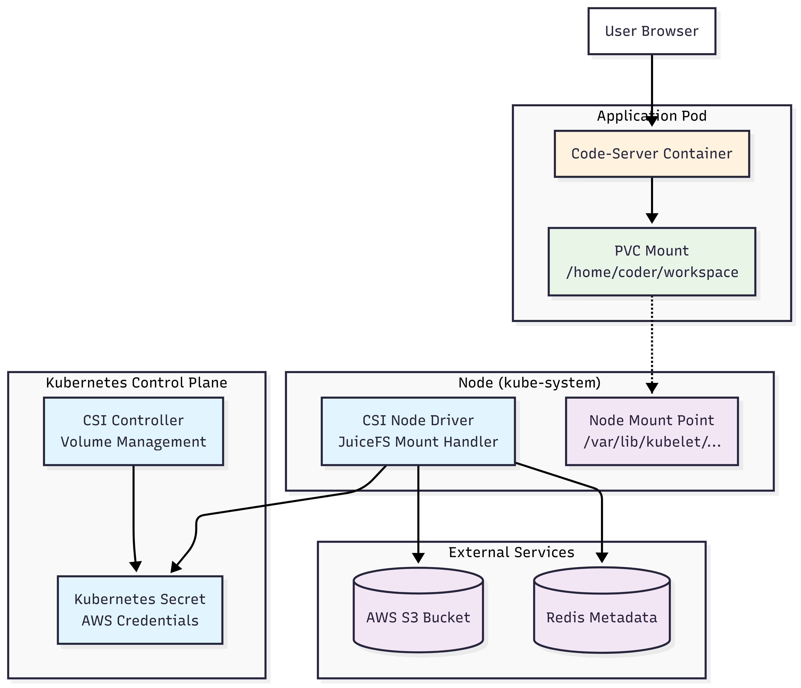
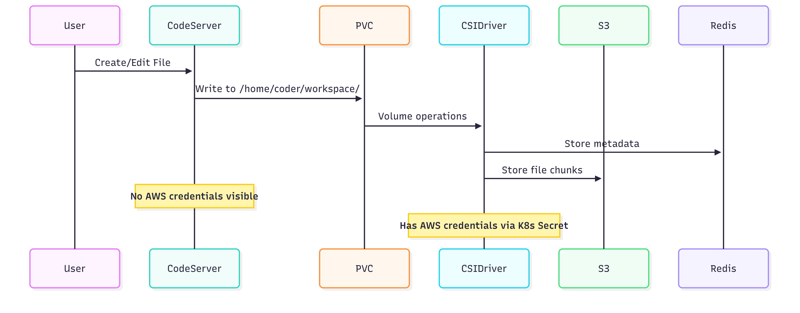

# JuiceFS CSI Driver - POC Documentation

## Problem

When deploying cloud-based development environments, we need persistent storage backed by AWS S3, but we cannot expose AWS credentials to the user-facing application container for security reasons. Users should be able to save files to S3 without ever seeing or accessing the AWS credentials.

## Architecture Overview



## Data Flow



## Solution: CSI Driver Pattern

We use **JuiceFS CSI Driver** with Community Edition where:

- **CSI Driver**: Runs in kube-system namespace, has AWS credentials via Kubernetes secrets, handles all S3 operations
- **Application Pod**: Runs Code-Server, has NO AWS credentials, accesses files via standard PVC mount
- **Kubernetes Secret**: Securely stores credentials, only accessible by CSI driver components

**Simple Analogy**: The CSI driver is like a bank vault system where security guards (CSI driver) manage access to your safe deposit box (S3), but you only get a key to your box, never seeing the master credentials.

## Solution Steps

### 1. Install JuiceFS CSI Driver
```bash
# Install CSI driver components
kubectl apply -f https://raw.githubusercontent.com/juicedata/juicefs-csi-driver/master/deploy/k8s.yaml

# Verify CSI driver installation
kubectl get pods -n kube-system | grep juicefs
```

### 2. Save the Deployment File
Create a file named `juicefs-csi.yaml` with the following content:

```yaml
# Redis Deployment for JuiceFS Metadata Store 
apiVersion: apps/v1
kind: Deployment
metadata:
  name: redis-juicefs
  namespace: default
  labels:
    app: redis-juicefs
spec:
  replicas: 1
  selector:
    matchLabels:
      app: redis-juicefs
  template:
    metadata:
      labels:
        app: redis-juicefs
    spec:
      containers:
      - name: redis
        image: redis:7-alpine
        ports:
        - containerPort: 6379
          name: redis
        command: 
        - redis-server
        - --appendonly
        - "yes"
        volumeMounts:
        - name: redis-data
          mountPath: /data
        resources:
          requests:
            memory: "128Mi"
            cpu: "100m"
          limits:
            memory: "256Mi"
            cpu: "200m"
      volumes:
      - name: redis-data
        emptyDir: {}

---
# Redis Service for JuiceFS Metadata Store
apiVersion: v1
kind: Service
metadata:
  name: redis
  namespace: default
spec:
  selector:
    app: redis-juicefs
  ports:
  - name: redis
    port: 6379
    targetPort: 6379
  type: ClusterIP

---

# JuiceFS Secret for CSI Driver (Community Edition)
apiVersion: v1
kind: Secret
metadata:
  name: juicefs-secret
  namespace: default
type: Opaque
stringData:
  name: "workspace"
  metaurl: "redis://redis.default.svc.cluster.local:6379/1"
  storage: "s3"
  bucket: "https://k3s-cluster-storage-a95693a6.s3.ap-southeast-1.amazonaws.com"
  access-key: "........"
  secret-key: "......"

---
# JuiceFS Storage Class
apiVersion: storage.k8s.io/v1
kind: StorageClass
metadata:
  name: juicefs-sc
provisioner: csi.juicefs.com
parameters:
  csi.storage.k8s.io/node-publish-secret-name: juicefs-secret
  csi.storage.k8s.io/node-publish-secret-namespace: default
  csi.storage.k8s.io/provisioner-secret-name: juicefs-secret
  csi.storage.k8s.io/provisioner-secret-namespace: default
volumeBindingMode: Immediate

---
# JuiceFS Persistent Volume
apiVersion: v1
kind: PersistentVolume
metadata:
  name: juicefs-pv
  labels:
    juicefs-name: workspace
spec:
  capacity:
    storage: 10Gi
  accessModes:
    - ReadWriteMany
  persistentVolumeReclaimPolicy: Retain
  csi:
    driver: csi.juicefs.com
    volumeHandle: workspace-volume
    nodePublishSecretRef:
      name: juicefs-secret
      namespace: default

---

# JuiceFS Persistent Volume Claim

apiVersion: v1
kind: PersistentVolumeClaim
metadata:
  name: juicefs-pvc
  namespace: default
spec:
  accessModes:
    - ReadWriteMany
  resources:
    requests:
      storage: 10Gi
  volumeName: juicefs-pv
  storageClassName: ""

---
# Code-Server Deployment using CSI Volume

apiVersion: apps/v1
kind: Deployment
metadata:
  name: code-server-csi
  namespace: default
  labels:
    app: code-server-csi
spec:
  replicas: 1
  selector:
    matchLabels:
      app: code-server-csi
  template:
    metadata:
      labels:
        app: code-server-csi
    spec:
      containers:
      - name: code-server
        image: ghcr.io/coder/code-server:latest
        imagePullPolicy: Always
        
        ports:
        - containerPort: 8080
          name: http
          protocol: TCP
        
        env:
        - name: PASSWORD
          value: "coder123"
        - name: USER
          value: "coder"
        # NO AWS CREDENTIALS IN APPLICATION CONTAINER
        
        command: ["/bin/bash"]
        args:
        - -c
        - |
          set -euo pipefail
          
          # Wait for workspace to be mounted
          until [ -d /home/coder/workspace ]; do
            sleep 1
          done
          
          # Create workspace structure
          mkdir -p /home/coder/workspace/{projects,scripts,config}
          
          # Create a welcome file
          cat > /home/coder/workspace/README.md << 'EOF'
          # JuiceFS CSI Driver Workspace
          
          This workspace uses:
          - JuiceFS Community Edition (free)
          - CSI Driver for standard Kubernetes storage
          - Redis metadata store
          - AWS S3 object storage
          - NO AWS credentials visible in this container
          EOF
          
          # Set proper ownership
          chown -R coder:coder /home/coder/workspace 2>/dev/null || true
          
          # Start code-server
          exec code-server \
            --bind-addr 0.0.0.0:8080 \
            --auth password \
            --disable-telemetry \
            --disable-update-check \
            --user-data-dir /home/coder/.config \
            /home/coder/workspace
          
        volumeMounts:
        - name: workspace-storage
          mountPath: /home/coder/workspace
        - name: codeserver-config
          mountPath: /home/coder/.config
          
        # Health checks
        readinessProbe:
          httpGet:
            path: /healthz
            port: 8080
            httpHeaders:
            - name: Accept
              value: "text/plain"
          initialDelaySeconds: 60
          periodSeconds: 10
          timeoutSeconds: 5
          successThreshold: 1
          failureThreshold: 3
          
        livenessProbe:
          httpGet:
            path: /healthz
            port: 8080
          initialDelaySeconds: 90
          periodSeconds: 30
          timeoutSeconds: 10
          failureThreshold: 3
          
        resources:
          requests:
            memory: "512Mi"
            cpu: "300m"
          limits:
            memory: "1Gi"
            cpu: "1000m"
            
        securityContext:
          runAsUser: 1000
          runAsGroup: 1000
          allowPrivilegeEscalation: false
          readOnlyRootFilesystem: false
      
      volumes:
      - name: workspace-storage
        persistentVolumeClaim:
          claimName: juicefs-pvc
      - name: codeserver-config
        emptyDir:
          sizeLimit: 100Mi
      
      restartPolicy: Always

---

# Code-Server Service (NodePort)

apiVersion: v1
kind: Service
metadata:
  name: code-server-csi
  namespace: default
  labels:
    app: code-server-csi
spec:
  selector:
    app: code-server-csi
  type: NodePort
  ports:
  - name: http
    protocol: TCP
    port: 8080
    targetPort: 8080
    nodePort: 30081
  sessionAffinity: ClientIP
```

### 3. Deploy the Stack
```bash
# Deploy the CSI solution
kubectl apply -f juicefs-csi.yaml

# Monitor deployment
kubectl get pods -w
```

### 4. Verify Deployment
```bash
# Check pod status (should show 1/1 Running)
kubectl get pods -l app=code-server-csi

# Check PVC and PV status
kubectl get pvc juicefs-pvc
kubectl get pv juicefs-pv

# Check CSI driver logs if needed
kubectl logs -n kube-system deployment/juicefs-csi-controller

# Get node IP for access
kubectl get nodes -o wide
```

### 5. Access VS Code
- URL: `http://NODE_IP:30081`
- Password: `coder123`

## Testing Security Isolation

### Test 1: Verify No AWS Credentials in Application Pod
```bash
# Should return empty (no AWS environment variables)
kubectl exec deployment/code-server-csi -- env | grep -i aws

# Should not find credential files
kubectl exec deployment/code-server-csi -- find /home -name "*aws*" -o -name "*credential*" 2>/dev/null
```

### Test 2: Verify File Access Works
```bash
# Create test file from application pod
kubectl exec deployment/code-server-csi -- echo "CSI security test" > /home/coder/workspace/test.txt

# Verify file exists
kubectl exec deployment/code-server-csi -- ls -la /home/coder/workspace/
kubectl exec deployment/code-server-csi -- cat /home/coder/workspace/test.txt
```

### Test 3: Verify CSI Components Not Accessible
```bash
# Should not show CSI processes
kubectl exec deployment/code-server-csi -- ps aux | grep -i csi || echo "CSI processes isolated - GOOD"

# Should not have AWS CLI access
kubectl exec deployment/code-server-csi -- which aws 2>/dev/null || echo "AWS CLI not available - GOOD"
```

### Test 4: Verify Mount Details Hidden
```bash
# Should not show JuiceFS mount internals
kubectl exec deployment/code-server-csi -- mount | grep -E "(juicefs|csi)" || echo "Mount details hidden - GOOD"

# Can only see the workspace directory
kubectl exec deployment/code-server-csi -- ls /home/coder/
```

## Verification Checklist

**Security Verification:**
- [ ] No AWS environment variables in application container
- [ ] No credential files accessible from application pod
- [ ] CSI driver processes not visible to application
- [ ] JuiceFS mount details abstracted away

**Functionality Verification:**
- [ ] Files created in VS Code appear in workspace
- [ ] Files persist across pod restarts
- [ ] PVC shows as bound
- [ ] Code-server accessible via browser

**Expected Results:**
- Application pod: No AWS access, full file access via PVC
- CSI driver: AWS credentials managed via Kubernetes secrets
- Files automatically sync to S3 bucket via CSI-managed JuiceFS mount