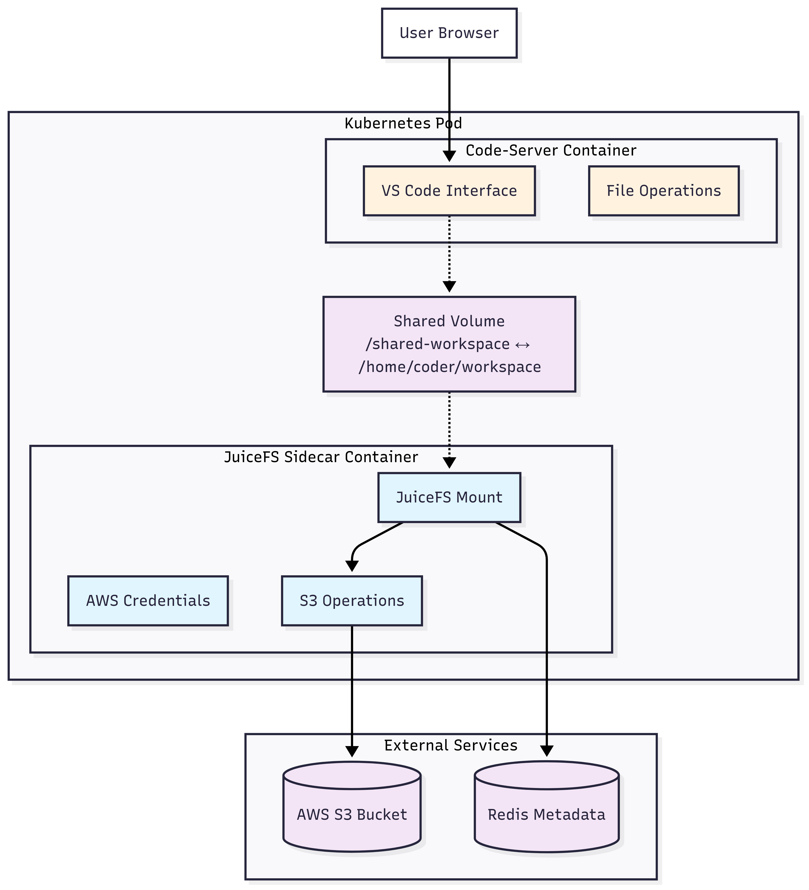
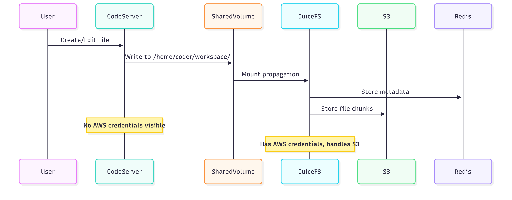

# JuiceFS Sidecar Security: POC Documentation

## Problem

When deploying cloud-based development environments, we need persistent storage backed by AWS S3, but we cannot expose AWS credentials to the user-facing application container for security reasons. Users should be able to save files to S3 without ever seeing or accessing the AWS credentials.

## Architecture Overview


## Data Flow



## Solution: Sidecar Pattern

We use a **sidecar container architecture** where:

- **JuiceFS Sidecar**: Has AWS credentials, handles S3 operations, mounts filesystem
- **Code-Server Main**: Runs VS Code interface, has NO AWS credentials, accesses files via shared mount
- **Shared Volume**: Allows file access between containers without credential sharing

**Simple Analogy**: The sidecar is like a security guard who unlocks a vault (S3) for you, then you can access the contents without ever seeing the keys.

## Why Not Use CSI Driver?

CSI Driver approach has limitations:
- Requires JuiceFS Enterprise Edition (paid)
- Needs pre-created volumes with tokens from web console
- Less flexibility for dynamic volume creation
- More complex setup and troubleshooting

Our sidecar approach uses JuiceFS Community Edition (free) and provides complete control over the storage setup.

## Solution Steps

### 1. Save the Deployment File
Create a file named `juicefs-sidecar.yaml` with the following content:

```yaml
# ---------------------------------------
# 1️⃣ Redis for JuiceFS Metadata Storage
# ---------------------------------------
apiVersion: apps/v1
kind: Deployment
metadata:
  name: redis-juicefs
  namespace: default
  labels:
    app: redis-juicefs
spec:
  replicas: 1
  selector:
    matchLabels:
      app: redis-juicefs
  template:
    metadata:
      labels:
        app: redis-juicefs
    spec:
      containers:
      - name: redis
        image: redis:7-alpine
        ports:
        - containerPort: 6379
          name: redis
        command: 
        - redis-server
        - --appendonly
        - "yes"
        volumeMounts:
        - name: redis-data
          mountPath: /data
        resources:
          requests:
            memory: "128Mi"
            cpu: "100m"
          limits:
            memory: "256Mi"
            cpu: "200m"
      volumes:
      - name: redis-data
        emptyDir: {}

---
apiVersion: v1
kind: Service
metadata:
  name: redis
  namespace: default
spec:
  selector:
    app: redis-juicefs
  ports:
  - name: redis
    port: 6379
    targetPort: 6379
  type: ClusterIP

---
# ---------------------------------------
# 2️⃣ AWS Credentials Secret (Restricted Access)
# ---------------------------------------
apiVersion: v1
kind: Secret
metadata:
  name: aws-credentials
  namespace: default
  labels:
    app: juicefs
type: Opaque
stringData:
  AWS_ACCESS_KEY_ID: "....."
  AWS_SECRET_ACCESS_KEY: "......."
  AWS_DEFAULT_REGION: "ap-southeast-1"
  S3_BUCKET: "https://bucket-name.s3.ap-southeast-1.amazonaws.com"

---
# ---------------------------------------
# 3️⃣ Code-Server with Secure JuiceFS Sidecar
# ---------------------------------------
apiVersion: apps/v1
kind: Deployment
metadata:
  name: code-server
  namespace: default
  labels:
    app: code-server
spec:
  replicas: 1
  selector:
    matchLabels:
      app: code-server
  template:
    metadata:
      labels:
        app: code-server
    spec:
      # Security: Run as non-root user where possible
      securityContext:
        fsGroup: 1000
      
      containers:
      
      # SIDECAR: JuiceFS Mount Handler (HAS AWS credentials)
      - name: juicefs-mounter
        image: juicedata/mount:latest
        imagePullPolicy: Always
        
        command: ["/bin/bash"]
        args:
        - -c
        - |
          set -euo pipefail
          
          # Install required packages
          apt-get update -qq && apt-get install -y -qq redis-tools curl
          
          # Install JuiceFS Community Edition
          curl -sSL https://d.juicefs.com/install | sh -
          
          # Wait for Redis to be ready
          echo "Waiting for Redis..."
          RETRY_COUNT=0
          MAX_RETRIES=30
          until redis-cli -h redis -p 6379 ping > /dev/null 2>&1; do
            RETRY_COUNT=$((RETRY_COUNT + 1))
            if [ $RETRY_COUNT -ge $MAX_RETRIES ]; then
              echo "Failed to connect to Redis after $MAX_RETRIES attempts"
              exit 1
            fi
            sleep 2
          done
          echo "Redis connection successful"
          
          # Format JuiceFS filesystem with proper error handling
          echo "Formatting JuiceFS filesystem..."
          if ! juicefs format \
              --storage s3 \
              --bucket "$S3_BUCKET" \
              --access-key "$AWS_ACCESS_KEY_ID" \
              --secret-key "$AWS_SECRET_ACCESS_KEY" \
              --block-size 4096 \
              redis://redis:6379/1 \
              k3s-storage; then
            echo "Format failed, checking if already formatted..."
            # Check if already formatted by trying to get status
            if ! juicefs status redis://redis:6379/1; then
              echo "JuiceFS format failed and database not formatted"
              exit 1
            fi
            echo "Database already formatted, continuing..."
          fi
          
          # Create mount point and mount JuiceFS
          mkdir -p /shared-workspace
          echo "Mounting JuiceFS..."
          juicefs mount redis://redis:6379/1 /shared-workspace \
              --cache-dir /tmp/juicefs-cache \
              --cache-size 256 \
              --no-usage-report \
              --foreground
            
        env:
        # ONLY SIDECAR CONTAINER HAS AWS CREDENTIALS
        - name: AWS_ACCESS_KEY_ID
          valueFrom:
            secretKeyRef:
              name: aws-credentials
              key: AWS_ACCESS_KEY_ID
        - name: AWS_SECRET_ACCESS_KEY
          valueFrom:
            secretKeyRef:
              name: aws-credentials
              key: AWS_SECRET_ACCESS_KEY
        - name: AWS_DEFAULT_REGION
          valueFrom:
            secretKeyRef:
              name: aws-credentials
              key: AWS_DEFAULT_REGION
        - name: S3_BUCKET
          valueFrom:
            secretKeyRef:
              name: aws-credentials
              key: S3_BUCKET
              
        securityContext:
          privileged: true  # Required for FUSE mounting
          capabilities:
            add: ["SYS_ADMIN"]
            
        volumeMounts:
        - name: shared-workspace
          mountPath: /shared-workspace
          mountPropagation: Bidirectional  # Allow mount to be visible to other containers
        - name: juicefs-cache
          mountPath: /tmp/juicefs-cache
          
        # Health checks to ensure JuiceFS is working
        livenessProbe:
          exec:
            command: 
            - /bin/bash
            - -c
            - "mountpoint -q /shared-workspace && echo 'test' > /shared-workspace/.health-check && rm -f /shared-workspace/.health-check"
          initialDelaySeconds: 60
          periodSeconds: 30
          timeoutSeconds: 10
          failureThreshold: 3
          
        readinessProbe:
          exec:
            command: ["mountpoint", "-q", "/shared-workspace"]
          initialDelaySeconds: 30
          periodSeconds: 10
          timeoutSeconds: 5
          
        resources:
          requests:
            memory: "256Mi"
            cpu: "200m"
          limits:
            memory: "512Mi"
            cpu: "500m"
      
      # MAIN CONTAINER: Code-Server (NO AWS credentials)
      - name: code-server
        image: ghcr.io/coder/code-server:latest
        imagePullPolicy: Always
        
        ports:
        - containerPort: 8080
          name: http
          protocol: TCP
        
        env:
        - name: PASSWORD
          value: "coder123"
        - name: USER
          value: "coder"
        # The code-server cannot access AWS creds from sidecar
        
        command: ["/bin/bash"]
        args:
        - -c
        - |
          set -euo pipefail
          
          # Wait for JuiceFS mount from sidecar
          MOUNT_WAIT=0
          MAX_MOUNT_WAIT=120
          until mountpoint -q /home/coder/workspace; do
            MOUNT_WAIT=$((MOUNT_WAIT + 1))
            if [ $MOUNT_WAIT -ge $MAX_MOUNT_WAIT ]; then
              exit 1
            fi
            sleep 1
          done
          
          # Test workspace access
          echo "test" > /home/coder/workspace/.access-test 2>/dev/null && rm -f /home/coder/workspace/.access-test || true
          
          # Create workspace structure
          mkdir -p /home/coder/workspace/{projects,scripts,config}
          chown -R coder:coder /home/coder/workspace 2>/dev/null || true
          
          # Start code-server (PASSWORD env var is automatically used)
          exec code-server \
            --bind-addr 0.0.0.0:8080 \
            --auth password \
            --disable-telemetry \
            --disable-update-check \
            --user-data-dir /home/coder/.config \
            /home/coder/workspace
          
        volumeMounts:
        - name: shared-workspace
          mountPath: /home/coder/workspace
          mountPropagation: HostToContainer  # Receive mounts from sidecar
        - name: codeserver-config
          mountPath: /home/coder/.config
          
        # Health checks for code-server
        readinessProbe:
          httpGet:
            path: /healthz
            port: 8080
            httpHeaders:
            - name: Accept
              value: "text/plain"
          initialDelaySeconds: 90
          periodSeconds: 10
          timeoutSeconds: 5
          successThreshold: 1
          failureThreshold: 3
          
        livenessProbe:
          httpGet:
            path: /healthz
            port: 8080
          initialDelaySeconds: 120
          periodSeconds: 30
          timeoutSeconds: 10
          failureThreshold: 3
          
        resources:
          requests:
            memory: "512Mi"
            cpu: "300m"
          limits:
            memory: "1Gi"
            cpu: "1000m"
            
        securityContext:
          runAsUser: 1000
          runAsGroup: 1000
          allowPrivilegeEscalation: false
          readOnlyRootFilesystem: false
      
      # Shared volumes
      volumes:
      - name: shared-workspace
        emptyDir: {}  # Temporary shared space for mount propagation
      - name: juicefs-cache
        emptyDir:
          sizeLimit: 1Gi
      - name: codeserver-config
        emptyDir:
          sizeLimit: 100Mi
      
      # Pod-level settings
      restartPolicy: Always
      terminationGracePeriodSeconds: 60

---
# ---------------------------------------
# 4️⃣ Code-Server Service (NodePort)
# ---------------------------------------
apiVersion: v1
kind: Service
metadata:
  name: code-server
  namespace: default
  labels:
    app: code-server
spec:
  selector:
    app: code-server
  type: NodePort
  ports:
  - name: http
    protocol: TCP
    port: 8080
    targetPort: 8080
    nodePort: 30080
  sessionAffinity: ClientIP  # Maintain session stickiness
```

### 2. Deploy the Stack
```bash
kubectl apply -f juicefs-sidecar.yaml
```
Monitor deployment
```bash

kubectl get pods -w
```

### 3. Verify Deployment
```bash
# Check pod status
kubectl get pods

# Check both container logs
kubectl logs deployment/code-server -c juicefs-mounter
kubectl logs deployment/code-server -c code-server
```

## Testing Security Isolation

### Test 1: Verify No AWS Credentials in Code-Server
```bash
# Should return empty (no AWS environment variables)
kubectl exec deployment/code-server -c code-server -- env | grep -i aws

# Should show AWS credentials are present in sidecar only
kubectl exec deployment/code-server -c juicefs-mounter -- env | grep AWS
```

### Test 2: Verify File Access Works
```bash
# Create test file from code-server
kubectl exec deployment/code-server -c code-server -- echo "Security test" > /home/coder/workspace/test.txt

# Verify file is visible in both containers
kubectl exec deployment/code-server -c code-server -- ls -la /home/coder/workspace/
kubectl exec deployment/code-server -c juicefs-mounter -- ls -la /shared-workspace/
```

### Test 3: Verify AWS CLI Not Accessible
```bash
# Should fail or show "command not found"
kubectl exec deployment/code-server -c code-server -- which aws
kubectl exec deployment/code-server -c code-server -- aws s3 ls 2>/dev/null || echo "AWS access denied - GOOD!"
```

## Verification Checklist

**Security Verification:**
- [ ] No AWS environment variables in code-server container
- [ ] AWS CLI not available in code-server container
- [ ] No credential files accessible from code-server

**Expected Results:**
- Code-server: No AWS access, full file access
- JuiceFS sidecar: AWS credentials present, handles S3 operations
- Files automatically sync to S3 bucket via JuiceFS chunks
